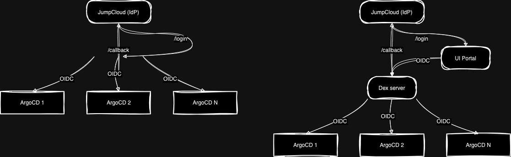
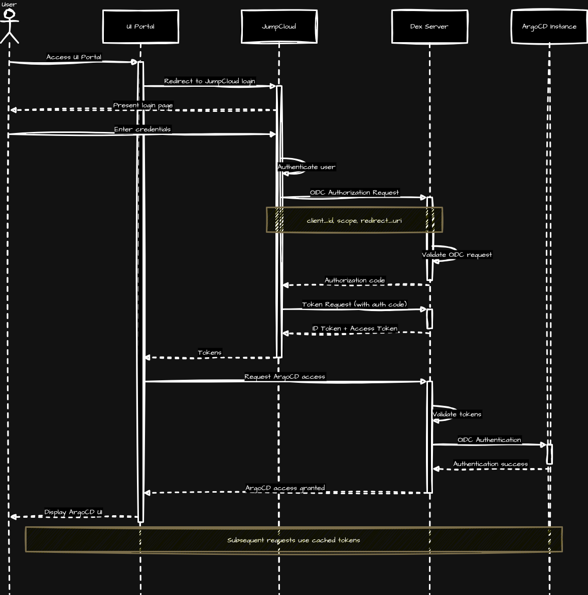

# Auth Proxy and UI

Use a Dex server to federate access between JC<>Dex<>ArgoCD Deployments.

## Components

- [JumpCloud](https://jumpcloud.com): IdP 🪄
- [Dex](https://dexidp.io): OIDC server to federate auth
- [ArgoCD](https://argoproj.github.io/argo-cd): CD
- [UI Portal](ui-portal): Web app to show different Argo deployments

### Argo Portal Flow

### Dex Proxy Sequence Diagram

